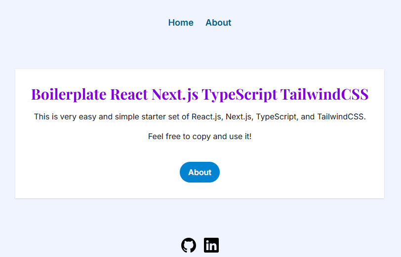

# Boilerplate React Next.js TypeScript TailwindCSS

This is a very simple and easy-to-use starter template for React.js, Next.js, TypeScript, and TailwindCSS.
 Feel free to copy and use it!

## Screenshot

 

## Demo

Deployed to Vercel, [here](https://boilerplate-react-nextjs-typescript.vercel.app)

## Features

- React 18 / Next.js App Router
- TypeScript support
- TailwindCSS, including dark mode support
- Google Fonts with CSS variables (`--font-title`, `--font-text`)
- Layout component with `<Header />` and `<Footer />`
- UI component with `<Button />`
- Easily customizable styles using CSS variables and Tailwind classes
- Dynamic site configuration with `src/app/constants/site.ts`
- 404 page
- Dark mode setting

## Customization Guide

- **Favicon**: Replace `src/app/favicon.ico`
- **Fonts**: Modify in `src/app/layout.tsx` and `tailwind.config.js`
- **Global styles**: Customize `src/styles/globals.css`
- **Meta tags**: Set default values in `src/app/layout.tsx`. You can override them per page as needed.
- **Color and typography**: Defined in `src/app/globals.css` using CSS variables (e.g. `--background`, `--font-title`, `--titleColor`).  
Dark mode is handled under the `@media (prefers-color-scheme: dark)` section.
- **404 page**: Customize the default in `src/app/not-found.tsx`.

## Optional Integrations ##
- **Testing** – [Jest](https://jestjs.io), [Testing Library (React)](https://testing-library.com/docs/react-testing-library/intro), [Cypress](https://www.cypress.io/)
- **Lint & Format** – [ESLint](https://eslint.org), [Prettier](https://prettier.io/)
- **State Management** – [Redux Toolkit](https://redux-toolkit.js.org)
- **Documentation** – [Storybook](https://storybook.js.org)
- **Accessibility & Audit** – [Lighthouse](https://pagespeed.web.dev), [WAVE](https://wave.webaim.org)

## Create Your Own From Scratch

To build a similar setup manually, run:

```bash
npx create-next-app@latest nameOfYourApp --typescript
```

Then I got such quiestions and I answered Yes to the first 4, No to the last 2:

```bash
√ Would you like to use ESLint? ... No / Yes
√ Would you like to use Tailwind CSS? ... No / Yes
√ Would you like your code inside a `src/` directory? ... No / Yes
√ Would you like to use App Router? (recommended) ... No / Yes
√ Would you like to use Turbopack for `next dev`? ... No / Yes
√ Would you like to customize the import alias (`@/*` by default)? ... No / Yes
```

Once installed, follow the generated README or use this one for guidance.


This is a [Next.js](https://nextjs.org) project bootstrapped with [`create-next-app`](https://nextjs.org/docs/app/api-reference/cli/create-next-app).

## Getting Started

First, run the development server:

```bash
npm run dev
# or
yarn dev
# or
pnpm dev
# or
bun dev
```

Open [http://localhost:3000](http://localhost:3000) with your browser to see the result.

You can start editing the page by modifying `app/page.tsx`. The page auto-updates as you edit the file.

